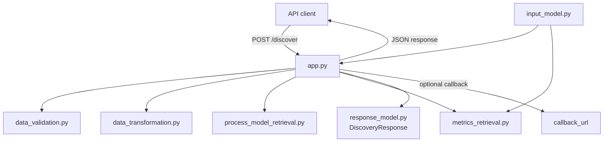

# onco-miner

> **Process mining for oncology** — a backend module that takes **pre-filtered** oncology event data (e.g., oBDS from German cancer registries) and performs **process discovery** and **performance analysis** for dashboarding and research reuse.

---

<p align="center">
  
  
  
  
</p>

---

## What it does (scope)

- **Process discovery** on **already filtered** oncology event data  
- **Performance analysis** (e.g., frequencies, durations, throughput, ...)   

---

## Why it exists

Transparent and reproducible analysis of real oncology care pathways helps improve quality and equity of care through data exploration. **onco-miner** focuses on the mining and analysis layer only, so it can plug into different data providers and dashboards without owning data preparation.

---

## Architecture



---

## Docker Setup

Build and start the service with Docker Compose:

```bash
docker compose up --build
```

If you already built the image before, you can also run:

```bash
docker compose up
```

The API will be reachable at `http://localhost:8000`.
Healthcheck:

```bash
curl http://localhost:8000/health
```

---

## Local Setup

Dependencies are defined in `pyproject.toml` 
Install the package:

```bash
pip install .
```

For development tooling:

```bash
pip install -e .[dev]
```

---

## Technical Details

### Expected input Format

The Input should be provided as a json dict with the following structure:

    {
        "data":
        {
            "concept:name": 
            {
                "1": "StartEventA",
                "2": "EventB",
                "3": "EndEventA",
                "4": "EventB"
            },
            "case:concept:name":
            {
                "1": "Trace1",
                "2": "Trace1",
                "3": "Trace1",
                "4": "Trace2"
            },
            "time:timestamp":
            {
                "1": "2025-10-17T11:45:23Z",
                "2": "2025-10-18T23:48:05Z",
                "3": "2025-10-121T12:37:09Z",
                "4": "2024-08-12T08:27:12Z"
            }
        },
        "parameters":
        {
            "active_events":
            {
                "positive_events": ["StartEventA"],
                "negative_events": ["EndEventA"],
                "singular_events": ["EventB"]
            },
            "n_top_variants": 10,
            "reduce_complexity_by": 0,
            "add_counts": false,
            "state_changing_events": null,
            "start_node_name": "start_node",
            "end_node_name": "end_node"
        },
        "callback_url": "https://example.com/",
        "id": "string"
    }


Concerning the **data**:

Each event should have an index, a trace name, an event name and a time stamp in the ISO8601 standard.

The **data** in the following Example consists of two traces, _Trace1_ and _Trace2_.

_Trace1_ consists of three events, _StartEventA (2025-10-17T11:45:23Z)_, _EventB (2025-10-18T23:48:05Z)_
and _EndEventA (2025-10-121T12:37:09Z)_.
_StartEventA_ and _EndEventA_ are used to describe a state change,
where _state A_ is described through its start and its end.

_Trace2_ consists of one event, _EventB (2024-08-12T08:27:12Z)_.

Concerning the **Parameters**:

_active_events_ should be a dictionary containing three keys, _positive_events_, _negative_events_ and _singular_events_.
The values of these dicts should be lists with event names occurring in the data.
_positive_events_ should contain events that describe the beginning of a state or a long-lasting events.
_negative_events_ should contain events that describe the ending of a state or a long-lasting events.
_singular_events_ should contain events occurring at a singular moment.
If no parameters for active events are provided, all occurring events are handled as singular events.

Some metrics are calculated not with all data, but only traces that match the most often occurring variants.
To set how many variants should be considered, use _top_variants_.
If no value is provided, the top 10 variants are used.

If you don't want all traces to be included in the calculation,
and you want to reduce the complexity of the graph and therefore reduce the number of trace variants,
set _reduce_complexity_by_ to a value between 0 and 1.
If the value is set to 0.7,
only traces of the most common variants are kept up unitl these variants span 30% of the overall traces.
The traces of the least common variant included are kept in full
so that the number of traces of the reduced dataset may be more than 30% of the original dataset.
The graph as well as metrics are both caluclated on the reduced data set.
The default value is 0.

If _add_counts_ is set to True, the events of each trace, grouped by event type, get numbered.
This means that if one trace has the events [EventA, EventB, EventA, EventC],
the trace then becomes [EventA_1, EventB_1, EventA_2, EventC_1].
The default value is False.

Instead of just numbering the events, one can also declare event types that are considered state changing.
If this is done, the occurrence of one of these events leads to a state change in the trace.
Events of the same event type but in a different state are not considered the same.
If a trace hast the events [EventC, EventA, EventB, EventD, EventA, EventC]
and the event types EventA and EventB are declared as state changing,
the trace becomes [EventC_0.0, EventA_1.0, EventB_1.1, EventD_1.1, EventA_2.1, EventC_2.1].
As you can see, state changes become part of the event names.
The default value is that no events are considered state changing.

For creation of the process model graph, custom start and end nodes are added.
Through _start_node_name_ and _end_node_name_, custom names can be given to these nodes.
As default names "start_node" and "end_node" are used.

Concerning the **callback_url**:

If you want the result graph not only to be returned to the requesting instance, but to another endpoint as well,
you can provide a url where the result construct will be sent.

Concerning the **id**:
If you want an ID to identify a result,
especially if the callback feature ist used, you can provide an ID with the request.
This ID will then be returned with the result.

### Config File

The config file can be used to exclude metrics from calculation.
To do so, you just need to remove the hashtag in the respective metric names row.
When a metric is excluded, instead of a value, null is returned.
After changing the file in the docker container, a restart of the docker container is required for the change to kick in.

### Output Format

    {
        "graph":
        {
            "connections":
            [
                {
                    "e1": str,
                    "e2": str,
                    "frequency": int,
                    "median": float,
                    "min": float,
                    "max": float,
                    "stdev": float,
                    "sum": float,
                    "mean": float
                }
            ]
        }
        "metrics":
        {
            "n_traces": int | null,
            "n_events": int | null,
            "n_variants": int | null,
            "top_variants":
            {
                "{rank}": 
                {
                    "event_sequence": [str],
                    "frequency": int,
                    "mean_duration": float
                }
            } | null,
            "tbe":
            [
                {
                    "e1": str,
                    "e2": str,
                    "frequency": -1,
                    "median": float,
                    "min": float,
                    "max": float,
                    "stdev": float,
                    "sum": float,
                    "mean": float
                }
            ] | null,
            "active_events":
            {
                "yearly":
                {
                    "{start_time}": int
                },
                "monthly":
                {
                    "{start_time}": int
                },
                "weekly":
                {
                    "{start_time}": int
                }
            } | null,
            "max_trace_length": int | null,
            "min_trace_length": int | null,
            "max_trace_duration": float | null,
            "min_trace_duration": float | null,
            "event_frequency_distr":
            {
                "{event_name}": int,
            } | null,
            "trace_length_distr":
            {
                "{trace_length}": int,
            } | null
        }
        "created": str,
        "id": str | null
    }

The output consists of two major parts, the graph and the metrics as well as a timestamp of creation and an ID.

#### The Graph
The graph consists of connections which represent the directly-follows-graph of the provided data.
The graph is directed.
Each connection consists of a tail (_e1_) and a head (_e2_), which both are event names.
Additionally, each connection has a variety of statistics regarding this connection.
_Frequency_ is the number of times, the connection exists in the dataset.
All other statistics are in regard to the time between the head- and the tail event.
They all have seconds as unit.
If a statistic could not or was not calculated, -1 is used as filler value as negative values can not occur naturally.
For example, between the start node of the graph and the events that occur first in traces,
all statistics regarding time are set to -1 as the start node is artificial.
Also, _stdev_ can be -1 when a connection only occurs once in the whole dataset.

#### The Metrics

The metrics deliver information about the overall dataset.

_n_traces_ is the number of traces in the dataset.

_n_events_ is the number of events in the dataset.

_n_variants_ is the number of different trace variants that exist in a dataset.
A trace variant is defined by the events in a trace and their order, but not the duration between events.

_top_variants_ is  a dict with the rank of the most often occurring trace variants as key
ranked by their prevalence with rank 0 being the most frequent.
The value is another dict that has the keys _event_sequence_, _frequency_ and _mean_duration_.
The value of _event_sequence_ is the variant defining order of events.
_frequency_ is the number of traces that match the variant.
_mean_duration_ is the mean duration of the traces matching the variant.

_tbe_ is the time between events only calculated on the traces that match the trace variants of _top_variants_.
Here, the output is designed the same way as in the graph, but _frequency_ is set to -1 as it is not calculated.
Also, no start- and end node is added so no full graph can be formed.
As before, all metrics have seconds as unit.

_active_events_ provides data about how many events of the data set happen at certain times.
The output is a dict with the keys _yearly_, _monthly_ and _weekly_.
The value for the key _yearly_ is another dict with time stamps as keys and integers as keys.
The timestamps are the first day of each year, from the earliest year events occur to the last.
The value for each timestamp is the number of active events from the key timestamp (included) to the next one (excluded).
The value to a matching timestamp can be 0, but not for the first and last timestamp.
The values for the _weekly_ and _monthly_ keys are built similarly,
with the timestamps for _monthly_ being the first of the month
and the timestamp for _weekly_ the first of the week, each at 00:00.

_max_trace_length_ is the amount of events in the trace with the most events.

_min_trace_length_ is the amount of events in the trace with the least events.

_max_trace_duration_ is the duration, in seconds, of the trace whose events span the longest timeframe.

_min_trace_duration_ is the duration in seconds of the trace whose events span the shortest timeframe.

_event_frequency_distr_ is a dict that has event names as keys and integers as values.
The value represents the number of this specific event in the dataset.
It is sorted from most to least.

_trace_length_distr_ is a dict that has the number of events per trace as key and the amount of traces with that length as value.
The key is formatted as a string.
It is sorted from the most traces (highest value) with that length to the least traces with that length (lowest value).

Through the config file, metrics can be removed from calculation.
Then, the returned value for that metric is _null_.

#### id

ID is an optional value.
If an ID was provided in the input, the same ID is returned with the output, if not, it is _null_.

#### created

A timestamp generated after calculation of the graph and the metrics.
