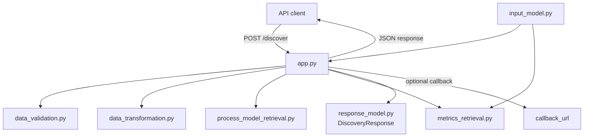

# onco-miner

> **Process mining for oncology** — a backend module that takes **pre-filtered** oncology event data (e.g., oBDS from German cancer registries) and performs **process discovery** and **performance analysis** for dashboarding and research reuse.

---

<p align="center">
  
  
  
  
</p>

---

## What it does (scope)

- **Process discovery** on **already filtered** oncology event data  
- **Performance analysis** (e.g., frequencies, durations, throughput, ...)   

---

## Why it exists

Transparent and reproducible analysis of real oncology care pathways helps improve quality and equity of care through data exploration. **onco-miner** focuses on the mining and analysis layer only, so it can plug into different data providers and dashboards without owning data preparation.

---

## Architecture



---

## Docker Setup

Build and start the service with Docker Compose:

```bash
docker compose up --build
```

If you already built the image before, you can also run:

```bash
docker compose up
```

The API will be reachable at `http://localhost:8000`.
Healthcheck:

```bash
curl http://localhost:8000/health
```

---

## Technical Details

### Expected input Format

The Input should be provided as a json dict with the following structure:

    {
        "data":
        {
            "concept:name": 
            {
                "1": "StartEventA",
                "2": "EventB",
                "3": "EndEventA",
                "4": "EventB"
            },
            "case:concept:name":
            {
                "1": "Trace1",
                "2": "Trace1",
                "3": "Trace1",
                "4": "Trace2"
            },
            "time:timestamp":
            {
                "1": "2025-10-17T11:45:23Z",
                "2": "2025-10-18T23:48:05Z",
                "3": "2025-10-121T12:37:09Z",
                "4": "2024-08-12T08:27:12Z"
            }
        }
        "parameters":
        {
            "active_events":
            {
                "positive_events": ["StartEventA"],
                "negative_events": ["EndEventA"],
                "singular_events": ["EventB"]
            },
            "n_top_variants": 10,
            "reduce_complexity_by": 0
            "add_counts": False,
            "state_changing_events": None,
        }
        "callback_url": "https://example.com/",
        "id": "string"
    }


Concerning the **data**:

Each event should have an index, a trace name, an event name and a time stamp in the ISO8601 standard.

The **data** in the following Example consists of two traces, _Trace1_ and _Trace2_.

_Trace1_ consists of three events, _StartEventA (2025-10-17T11:45:23Z)_, _EventB (2025-10-18T23:48:05Z)_
and _EndEventA (2025-10-121T12:37:09Z)_.
_StartEventA_ and _EndEventA_ are used to describe a state change,
where _state A_ is described through its start and its end.

_Trace2_ consists of one event, _EventB (2024-08-12T08:27:12Z)_.

Concerning the **Parameters**:

_active_events_ should be a dictionary containing three keys, _positive_events_, _negative_events_ and _singular_events_.
The values of these dicts should be lists with event names occurring in the data.
_positive_events_ should contain events that describe the beginning of a state or a long-lasting events.
_negative_events_ should contain events that describe the ending of a state or a long-lasting events.
_singular_events_ should contain events occurring at a singular moment.

Some metrics are calculated not with all data, but only traces that match the most often occurring variants.
To set how many variants should be considered, use _top_variants_.

If you don't want all traces to be included in the calculation,
but you want to reduce the complexity of the graph and therefore reduce the number of trace variants,
set _reduce_complexity_by_ to a value between 0 and 1.
If the value is set to 0.7,
only traces of the most common variants are kept up unitl these variants span 30% of the overall traces.
The traces of the least common variant included are kept in full
so that the number of traces of the reduced dataset may be more than 30% of the original dataset.
The graph as well as metrics are both caluclated on the reduced data set.

If _add_counts_ is set to True, the events of each trace, grouped by event type, get numbered.
This means that if one trace has the events [EventA, EventB, EventA, EventC],
the trace then becomes [EventA_1, EventB_1, EventA_2, EventC_1].

Instead of just numbering the events, one can also declare event types that are considered state changing.
If this is done, the occurrence of one of these events leads to a state change in the trace.
Events of the same event type but in a different state are not considered the same.
If a trace hast the events [EventC, EventA, EventB, EventD, EventA, EventC]
and the event types EventA and EventB are declared as state changing,
the trace becomes [EventC_0.0, EventA_1.0, EventB_1.1, EventD_1.1, EventA_2.1, EventC_2.1].
As you can see, state changes become part of the event names.

Concerning the **callback_url**:

If you want the result graph not only to be returned to the requesting instance, but to another endpoint as well,
you can provide a url where the result construct will be sent.

Concerning the **id**:
If you want an ID to identify a result, especially if the callback feature ist used, you can provide an ID with the request.
This ID will then be returned with the result.

### Output Format

    {
        "graph":
        {
            "connections":
            [
                {
                    "e1": str,
                    "e2": str,
                    "frequency": int,
                    "median": float,
                    "min": float,
                    "max": float,
                    "stdev": float,
                    "sum": float,
                    "mean": float
                }
            ]
            "start nodes":
            {
                "{event_name}": int
            },
            "end nodes":
            {
                "{event_name}": int
            },
        }
        "metrics":
        {
            "n_cases": int,
            "n_events": int,
            "n_variants": int,
            "top_variants":
            {
                "{rank}": [str]
            },
            "tbe":
            [
                {
                    "e1": str,
                    "e2": str,
                    "frequency": -1,
                    "median": float,
                    "min": float,
                    "max": float,
                    "stdev": float,
                    "sum": float,
                    "mean": float
                }
            ],
            "active_events":
            {
                "yearly":
                {
                    "{start_time}": int
                },
                "monthly":
                {
                    "{start_time}": int
                },
                "weekly":
                {
                    "{start_time}": int
                }
            },
            "max_trace_length": int,
            "min_trace_length": int,
            "max_trace_duration": float,
            "min_trace_duration": float,
            "event_frequency_distr":
            {
                "{event_name}": int,
            }
            "trace_length_distr":
            {
                "{trace_length}": int,
            }
        }
        "created": str,
        "id": str
    }

